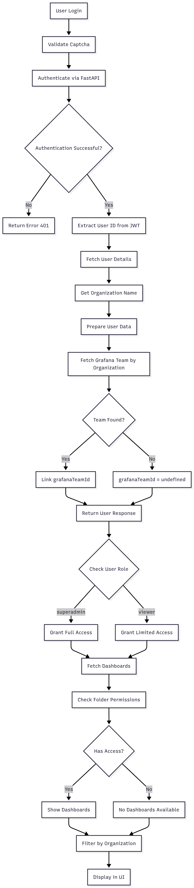

# AI4Voice Portal

A comprehensive monorepo containing both frontend and backend applications for the AI4Voice Portal project.

## Project Structure

```
AI4Voice_Portal/
├── app/                     # Next.js Frontend Application
│   ├── api/                 # API Routes
│   ├── dashboard/           # Dashboard Pages
│   └── login/               # Authentication Pages
├── components/              # React Components
│   ├── dashboards/          # Dashboard Components
│   ├── folders/             # Folder Management Components
│   ├── layout/              # Layout Components
│   ├── organizations/       # Organization Components
│   ├── teams/               # Team Management Components
│   ├── ui/                  # UI Components
│   └── users/               # User Management Components
├── hooks/                   # Custom React Hooks
├── lib/                     # Frontend Utilities & API Clients
│   ├── api/                 # API Client Functions
│   ├── store/               # State Management
│   └── utils/               # Utility Functions
├── types/                   # TypeScript Type Definitions
├── data/                    # Demo Data Files
├── backend/                 # FastAPI Backend Services
│   ├── app/                 # FastAPI Application
│   │   ├── api/             # API Endpoints
│   │   ├── core/            # Core Configuration
│   │   ├── models/          # Database Models
│   │   ├── schemas/         # Pydantic Schemas
│   │   ├── services/        # Business Logic
│   │   └── utils/           # Utility Functions
│   ├── requirements.txt     # Python Dependencies
│   └── README.md            # Backend Documentation
├── package.json             # Frontend Dependencies
├── next.config.ts           # Next.js Configuration
├── run.sh                   # Project Runner Script
└── README.md                # This file
```

## Frontend (Next.js)

The frontend is a Next.js application providing a Grafana administration portal with user management, dashboard management, and organization features.

### Frontend Setup

1. **Install dependencies:**
   ```bash
   npm install
   ```

2. **Run development server:**
   ```bash
   npm run dev
   ```

3. **Build for production:**
   ```bash
   npm run build
   npm start
   ```

4. **Open in browser:**
   Navigate to [http://localhost:3000](http://localhost:3000)

### Frontend Features

- **Grafana Integration**: Manage dashboards, folders, teams, and users
- **User Management**: Create, edit, and manage user accounts
- **Organization Management**: Single org by default; multi-org requires Grafana Server Admin API key
- **Team Management**: Organize users into teams
- **Dashboard Management**: View and organize Grafana dashboards
- **Modern UI**: Built with Tailwind CSS and Radix UI components

## Backend (FastAPI)

The backend provides authentication services with Bhashini integration, including captcha verification and JWT-based authentication.

### Backend Setup

1. **Navigate to backend directory:**
   ```bash
   cd backend
   ```

2. **Create virtual environment:**
   ```bash
   python -m venv venv
   source venv/bin/activate  # On Windows: venv\Scripts\activate
   ```

3. **Install dependencies:**
   ```bash
   pip install -r requirements.txt
   ```

4. **Set up environment variables:**
   ```bash
   cp env.example .env
   # Edit .env with your configuration
   ```

5. **Initialize database:**
   ```bash
   python init_db.py
   ```

6. **Run the server:**
   ```bash
   python -m uvicorn app.main:app --reload --host 0.0.0.0 --port 9010
   ```

7. **Access API documentation:**
   Navigate to [http://localhost:9010/docs](http://localhost:9010/docs)

### Backend Features

- **User Authentication**: Signin and signup functionality
- **Captcha Integration**: Image-based captcha for login security
- **JWT Tokens**: Secure token-based authentication
- **PostgreSQL Database**: Robust data persistence
- **RESTful API**: Clean and well-documented API endpoints
- **Email Services**: User verification and notifications

## Development Workflow

### Running Both Services

1. **Terminal 1 - Backend:**
   ```bash
   cd backend
   source venv/bin/activate
   python -m uvicorn app.main:app --reload --host 0.0.0.0 --port 9010
   ```

2. **Terminal 2 - Frontend:**
   ```bash
   npm run dev
   ```

### Using the Project Runner Script

Alternatively, you can use the provided runner script for easier management:

```bash
# Start both services in development mode
./run.sh dev

# Start only frontend
./run.sh frontend

# Start only backend
./run.sh backend

# Stop all services
./run.sh stop

# Check status
./run.sh status
```

### Environment Configuration

#### Frontend Environment Variables

1. **Create environment file:**
   ```bash
   # Create .env.local file manually
   touch .env.local
   ```

2. **Required variables for development:**
   ```bash
   BACKEND_URL=http://localhost:9010
   NEXT_PUBLIC_GRAFANA_URL=http://localhost:3001
   GRAFANA_API_KEY=your_grafana_api_key_here
   NEXTAUTH_SECRET=your_nextauth_secret_here
   NEXTAUTH_URL=http://localhost:3000
   ```

   Note: For multi-organization operations (list/create/delete across orgs), `GRAFANA_API_KEY` must have Grafana Server Admin permissions. With an Org Admin key, only the current organization is accessible and updatable.

3. **For production deployment:**
   - Set environment variables in your deployment platform (Vercel, Netlify, etc.)
   - Update `BACKEND_URL` to your production backend URL
   - Update `NEXT_PUBLIC_GRAFANA_URL` to your production Grafana URL
   - Use production API keys and secrets

#### Backend Environment Variables
- **Backend**: Uses Python environment variables (`.env` in backend folder)

## API Integration

The frontend communicates with the backend through REST API calls. The backend provides authentication endpoints that the frontend uses for user management.

## Observability

High-level view of the observability setup and data flow:



## Deployment

### Frontend Deployment
- Deploy to Vercel, Netlify, or any Next.js-compatible platform
- Set environment variables in your deployment platform

### Backend Deployment
- Deploy to platforms like Railway, Heroku, or AWS
- Configure database connection and environment variables
- Ensure PostgreSQL database is accessible

## Key Features

### Frontend Features
 - **Grafana Integration**: Full integration with Grafana API for dashboard and user management
 - **Multi-Organization Support**: Conditional; requires Grafana Server Admin API key
- **User Management**: Create, edit, and manage user accounts with role-based access
- **Dashboard Management**: View, organize, and manage Grafana dashboards
- **Team Management**: Organize users into teams with specific permissions
- **Folder Management**: Organize dashboards into folders
- **Modern UI**: Built with Tailwind CSS and Radix UI components
- **Responsive Design**: Works on desktop and mobile devices
- **Dark/Light Theme**: Toggle between themes

### Backend Features
- **Authentication**: JWT-based authentication with captcha verification
- **User Management**: Complete user lifecycle management
- **Security**: Password hashing, JWT tokens, and captcha protection
- **Database**: PostgreSQL with SQLAlchemy ORM
- **API Documentation**: Auto-generated Swagger/OpenAPI documentation
- **Email Services**: User verification and notifications
- **RESTful API**: Clean and well-documented API endpoints

## Technology Stack

### Frontend
- **Framework**: Next.js 14 with App Router
- **Language**: TypeScript
- **Styling**: Tailwind CSS
- **UI Components**: Radix UI
- **State Management**: Zustand
- **HTTP Client**: Axios
- **Icons**: Lucide React

### Backend
- **Framework**: FastAPI
- **Language**: Python 3.10+
- **Database**: PostgreSQL
- **ORM**: SQLAlchemy
- **Authentication**: JWT with Python-JOSE
- **Password Hashing**: bcrypt
- **Email**: FastAPI-Mail
- **Validation**: Pydantic

## Contributing

1. Fork the repository
2. Create a feature branch (`git checkout -b feature/amazing-feature`)
3. Make your changes
4. Test both frontend and backend
5. Commit your changes (`git commit -m 'Add some amazing feature'`)
6. Push to the branch (`git push origin feature/amazing-feature`)
7. Open a Pull Request

## License

This project is part of the COSS AI4X initiative.
